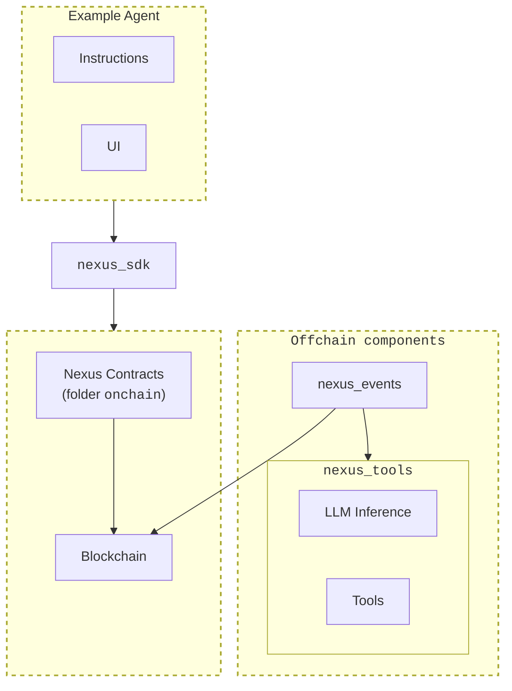

# Nexus

🚨 **DISCLAIMER:PLEASE READ BEFORE CONTRIBUTING OR USING THIS REPO** 🚨

This repository is **no longer actively maintained for long-term support**. The maintainers are currently working on an updated and improved architecture, and as such, this codebase should only be used for **educational purposes** or reference.

✅ You may explore the code to learn from past implementations.  
❌ Do **NOT** expect long-term updates, bug fixes, or compatibility improvements.  
❌ Do **NOT** contribute new features with the expectation of them being merged for future support.  

For updates on our latest work, follow our [blog][blog].  

Thank you for your understanding! 🙏  

## Overview

Nexus is the onchain Agentic Framework created by [Talus][talus].
The current version, provided here, is a sneak preview of our first iteration. There are
[many ideas](#what-remains-to-be-done) to develop it further but in it's current state it still
showcases what an onchain agentic framework is and it works end-to-end. For more details about
Talus, please visit our [blog][blog] and read our [litepaper][litepaper].

- [Nexus](#nexus)
  - [Architecture](#architecture)
  - [What is provided](#what-is-provided)
  - [Looking forward](#looking-forward)
  - [Contributing](#contributing)
  - [References](#references)
  - [Acknowledgments](#acknowledgments)
  - [License](#license)

## Architecture

Nexus is built on [Sui Move][sui_move], and consists of several key components:

1. **Onchain logic**: The onchain core logic of Nexus is implemented in Sui Move smart
   contracts in folder [`onchain`][onchain].
2. **SDK**: A Python SDK, in folder [`nexus_sdk`][nexus_sdk], which provides easy-to-use functions for setting up agents, interacting
   with the smart contracts, and running agentic workflows.
3. **Offchain components**: Services that handle LLM inference and anything that runs offchain,
   including supported tools. For more details, please see [`offchain`][offchain], where we
   define two Python packages named `nexus_events` and `nexus_tools`.

The high-level architecture is shown in the following diagram:

## What is provided

- Nexus, an onchain agentic framework, made of the components described above.
- [Examples][examples] of agents implemented with Nexus.
- Complete instructions on how to setup a full environment, including the blockchain, smart
  contracts, and the offchain components.

## Looking forward

Our first iteration focused on feasibility, and as an aid in exploring the design space. You
can build agents that work end-to-end. Here are some thoughts, which also give you an idea of
some of the things we are actively working on:

- Develop and experiment with novel **pricing/payment mechanisms**.
- Implement a **slashing mechanism** to penalize misbehaving nodes and maintain network integrity.
- Expand support to include **multiple modalities** beyond LLMs.
- Enable **customization of tool parameters** by both users and agents for greater flexibility.
- Introduce better **error handling** for agent responses to improve reliability.
- Implement **parallel execution** capabilities to enhance task processing efficiency.
- Develop support for **advanced task flow features**, such as loops and backtracking, to handle more complex workflows.
- Provide **offchain storage** options to reduce on-chain data storage needs.
- Introduce **privacy features** to allow for confidential or private data handling.

Stay tuned !

## Contributing

If you find and issue setting up and running Nexus, which is not covered by our documentation,
please open a [ticket][bugs] _and_ add the [`external`][label_external] label.

## References

- Talus [site][talus].
- Talus [blog][blog].
- Talus [litepaper][litepaper].

## Acknowledgments

In designing this version of Nexus, we have taken inspiration from [crewAI][crewAI]. Concepts
like 'Tool', 'Task' etc come from there. We also use crewAI tools in the implementation.

## License

- The Nexus agentic framework (in [`onchain`][onchain] and [`offchain`][offchain]), is
  licensed under [BSL 1.1][Nexus_License].
- The [Nexus SDK][nexus_sdk], is licensed under [Apache 2.0][SDK_License].
- [Examples][examples] are licensed under [Apache 2.0][Examples_License].

<!-- References -->

[talus]: https://talus.network/
[blog]: https://blog.talus.network/
[litepaper]: https://talus.network/litepaper.pdf
[crewAI]: https://github.com/crewAIInc/crewAI
[sui_move]: https://docs.sui.io/concepts/sui-move-concepts
[onchain]: ./onchain/
[offchain]: ./offchain/
[nexus_sdk]: ./nexus_sdk/
[examples]: ./examples/
[bugs]: https://github.com/Talus-Network/nexus/issues
[label_external]: https://github.com/Talus-Network/nexus/labels/external
[Nexus_License]: ./LICENSE
[SDK_License]: ./nexus_sdk/LICENSE
[Examples_License]: ./examples/LICENSE
